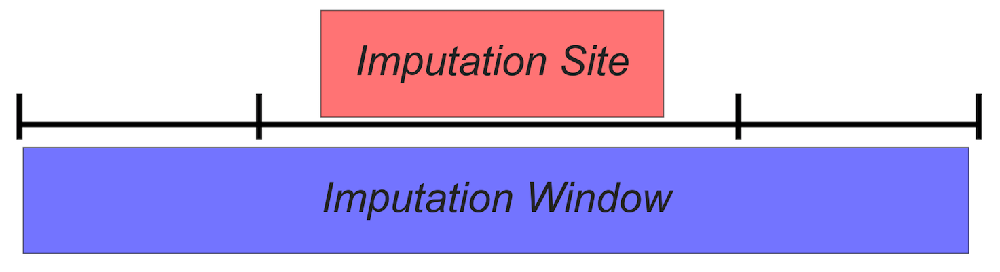

## Methylation Matrix Assembly

BSBolt AggregrateMatrix takes a list of CGmap files, compressed or uncompressed, and assembles a consensus methylation matrix. Methylated sites that 
pass a read depth threshold and are present in a set proportion of samples are included in the matrix. 

**BSBolt AggregateMatrix Commands**
```shell
optional arguments:
  -h, --help            show this help message and exit
  -F                    Comma separated list of CGmap file paths, or path to
                        text file with list of line separated CGmap file paths
  -S                    Comma separated list of samples labels. If sample
                        labels are not provided sample labels are extracted
                        from CGmap file paths. Can also pass path to txt for
                        line separated sample labels.
  -min-coverage         Minimum site read depth coverage for a site to be
                        included in the aggregate matrix
  -min-sample           Proportion of samples that must have a valid site
                        (above minimum coverage threshold), for a site to
                        beincluded in the aggregate matrix.
  -O                    Aggregate matrix output path
  -CG                   Only output CG sites
  -verbose              Verbose aggregation
```
**Aggregate Matrix Default Settings**

```shell
BSBolt AggregateMatrix -F cgmap_1,cgmap_2,cgmap_3 -O ~/test_matrix.txt
```
**Aggregate Matrix Default Settings - File List**

```shell
BSBolt AggregateMatrix -F cgmap_file_list.txt -O ~/test_matrix.txt
```

**Aggregate Matrix Default Settings - File List, Sample Labels, Verbose**

```shell
BSBolt AggregateMatrix -F cgmap_file_list.txt -S sample1,sample2,sample3 -O ~/test_matrix.txt -verbose
```

## Methylation Value Imputation

BSBolt Impute leverages the correlation structure between neighboring CpG sites to impute missing values through the use of a kNN sliding window.  
Within each window the nearest neighbors are calculated using Euclidean distance for non-null sites. The average value of k nearest neighbors is used to impute the null methylation value. 
To efficiently scale the algorithm, imputation can be performed in batches. 



```shell
  -h, --help  show this help message and exit
  -M          Path to BSB matrix file
  -B          Imputation sample batch size kNN imputation, by default the all
              of the samples will be processed as a single batch
  -W          Sliding window size for imputation
  -k          Number of neighbors to use for imputation, default = 5
  -t          Number of threads available for imputation
  -verbose    Verbose output
  -O          Output path for imputed matrix
  -R          Randomize batches
```  

**Impute No Batches**
```shell
BSBolt Impute -M ~/test_matrix.txt -W 100000 -k 3 -t 4 -O ~/test_matrix.impute.txt
```

**Batch Imputation**
```shell
BSBolt Impute -M ~/test_matrix.txt -W 100000 -k 3 -t 4 -O ~/test_matrix.impute.txt -B 10 -R
```
